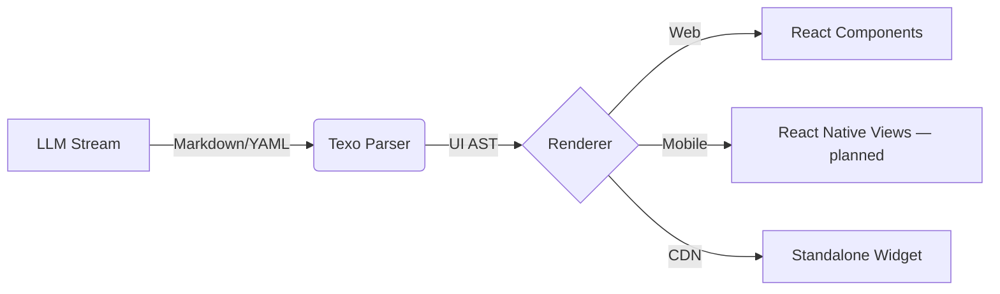

# Texo

> **Weave Text into UI.**
> A stream-oriented Generatable UI framework for the LLM era.

[](https://opensource.org/licenses/MIT)

## GitHub Pages

- README Page: `https://winm2m.github.io/texo-ui/`
- Playground (Vite build): `https://winm2m.github.io/texo-ui/playground/`

## Concept

**Texo** (Latin for *weave, construct*) is a framework designed to bridge the gap between **LLM Streaming Text** and **Native UI Components**.

Unlike Vercel's `v0` or standard generative UI tools that rely on brittle JSON or raw HTML generation, Texo uses a robust, human-readable syntax (**Markdown Directives + YAML**) to "weave" UI components in real-time.

It is platform-agnostic by design: the parser is renderer-independent. **React (Web)** and
**Legacy Web (Standalone, via CDN)** ship today; a **React Native** renderer is planned.

## Why Texo?

- **Stream-First:** Renders UI incrementally as the LLM types, without waiting for a complete JSON object.
- **Fault Tolerant:** If the syntax breaks, it gracefully degrades to text/code blocks. No white screens.
- **Platform Agnostic:** Write the parser once (`@texo-ui/core`), render anywhere (`@texo-ui/react`, `@texo-ui/standalone`).
- **Drop-in Ready:** Use it on WordPress, jQuery sites, or raw HTML via CDN without a build step.
- **Developer Control:** You define the components; the LLM just invokes them.

## Architecture

Texo transforms a stream of text into a Virtual UI Tree (AST) and reconciles it with your component registry.



## Usage Preview

## Install (npm)

Install Texo packages from npm:

```bash
npm install @texo-ui/core
```

Related packages:

```bash
npm install @texo-ui/react @texo-ui/kit
```

Package reference:

- `@texo-ui/core`: https://www.npmjs.com/package/@texo-ui/core

### 1. The Protocol (LLM Output)
The LLM generates standard Markdown mixed with **UI Directives**. A directive is a single
`:>` header line followed by indented ` - key: value` bullets; it closes as soon as the
indented block ends.

```markdown
Here is the analysis of your server costs:

:> label
 - text: "Monthly cost: $1,240 (up 8% MoM)"

And the details:

:> table
 - columns: ["Service", "Cost"]
 - rows: [{"Service":"EC2","Cost":800},{"Service":"RDS","Cost":440}]

:> button
 - label: "Open full breakdown"
 - action: "open-cost-breakdown"
 - variant: "primary"
```

Component names are the built-in primitives shipped in `@texo-ui/kit` — `stack`, `grid`,
`button`, `checkbox`, `input`, `label`, `table`, `chart`, `rect`, `svg`. Texo deliberately
does **not** ask the LLM to invoke bespoke per-use-case components; rich UIs are composed
from these primitives. Register your own components to extend the vocabulary.

> The older `::: name` + YAML-block form is still parsed for backward compatibility, but the
> system prompt Texo ships (`TEXO_STREAM_PRIMER`) instructs models to emit `:>` only.

### 2. Integration: React (Modern Web)

```jsx
import { TexoRenderer } from '@texo-ui/react';
import { createBuiltInComponents } from '@texo-ui/kit';

const registry = {
  ...createBuiltInComponents(),
  // add your own on top of the primitives
  // 'invoice-card': InvoiceCard,
};

function ChatInterface({ stream }) {
  return (
    <TexoRenderer
      content={stream}
      registry={registry}
      fallback={MarkdownView}
      onAction={(action) => console.log('User Action:', action)}
    />
  );
}
```

### 3. Integration: Standalone (CDN / Legacy Web)
You can use Texo without a build step (like webpack/vite). Just drop a script tag.

```html
<script src="https://cdn.jsdelivr.net/npm/@texo-ui/standalone@latest/dist/texo.iife.js"></script>

<div id="texo-root"></div>

<script>
  // 3. Initialize (jQuery-style)
  const ui = Texo.init('#texo-root');

  // 4. Stream data from LLM (Push text chunk by chunk)
  llmSource.on('data', (chunk) => {
    ui.stream(chunk); 
  });

  // 5. Handle User Interaction (Bi-directional)
  // When user clicks a button in the generated UI, it simulates a chat input
  ui.on('action', (payload) => {
    console.log('User Action:', payload); 
    // e.g. { type: 'submit', value: 'Confirm Purchase' }
    
    // Send back to Chat Interface or LLM
    chatInput.value = payload.value;
  });
</script>
```

## Directory Structure

```text
texo/
├── packages/
│   ├── core/           # @texo-ui/core (Parser & AST)
│   ├── react/          # @texo-ui/react (Web Renderer)
│   ├── kit/            # @texo-ui/kit (Built-in primitives + LLM catalog)
│   ├── data-adapter/   # @texo-ui/data-adapter (BYOS storage drivers)
│   └── standalone/     # @texo-ui/standalone (CDN Bundle)
├── examples/           # Demo Projects
├── package.json        # Monorepo Root
└── README.md
```

## Roadmap

- [x] **@texo-ui/core**: Streaming parser, AST builder, fault-tolerant recovery.
- [x] **@texo-ui/react**: React reconciler, registry and hooks.
- [x] **@texo-ui/kit**: Built-in primitives plus the machine-readable component catalog.
- [x] **@texo-ui/standalone**: Pre-bundled version for CDN usage.
- [x] **@texo-ui/data-adapter**: BYOS drivers (LocalStorage, Google Drive, Notion, Remote HTTP).
- [x] **Schema Generator**: `TEXO_STREAM_PRIMER` derives the LLM system prompt from the
      component catalog.
- [ ] **@texo-ui/native**: React Native adapter.
- [ ] **Storybook for `@texo-ui/kit`**: visual workbench for the primitives.

## License

MIT © Texo Authors
